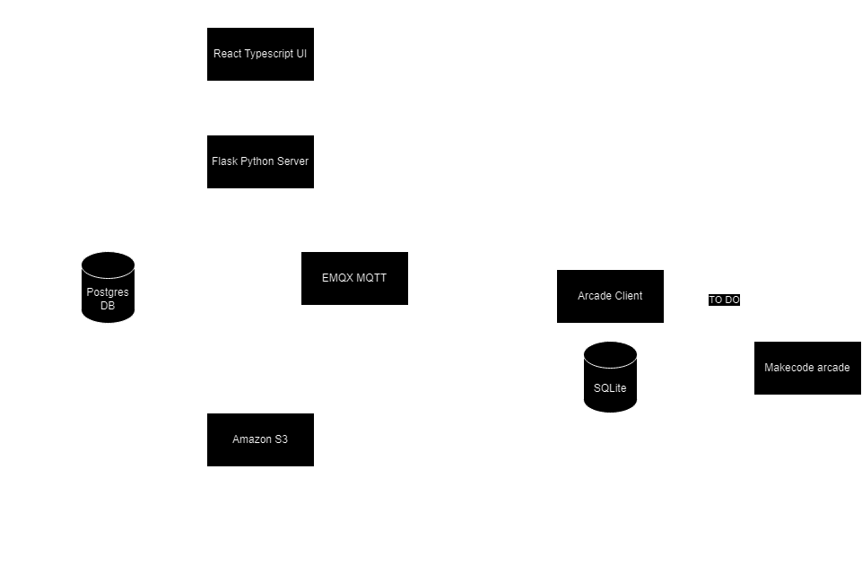

## Getting Starting

Ensure that python 3.10 is installed with an active
virtualenv. [Setup Instructions](https://docs.python.org/3/library/venv.html).

```shell
pip install -r requirements.txt
```

Bring up the stack with docker compose, ensure the db is created and then create a system admin account

When starting the application for the first time, you will need to set up the database and ensure that a system user is
created.

```shell
docker-compose up
flask provision-db
flask create-admin system@system.com passwd system
```

Once the database has been provisioned, start the local Flask server.

```shell
flask run
```

This will use the docker-compose.yaml to bring up all the dependencies for the arcade share system. This includes:

- [LocalStack](https://www.localstack.cloud/) For developing against AWS APIs. For ArcadeShare, the default storage for
  uploads is AWS S3 buckets, but there is an abstraction to allow this to be changed to any cloud provider.
- [Postgres](https://www.postgresql.org/) is the SQL database
- [EMQX](https://www.emqx.io/) is the MQTT broker. MQTT is the message bus that delivers events to subscribed
  devices

## Architecture



## UI Client

The UI client is located in the `client` directory. It was built using React and TypeScript. To run the client in
development mode:

```shell
cd frontend
npm run start
```

This will start the npm server on `localhost:3000`. The project is configured to port-forward to `127.0.0.1:5000` which
is the flask server. test11


